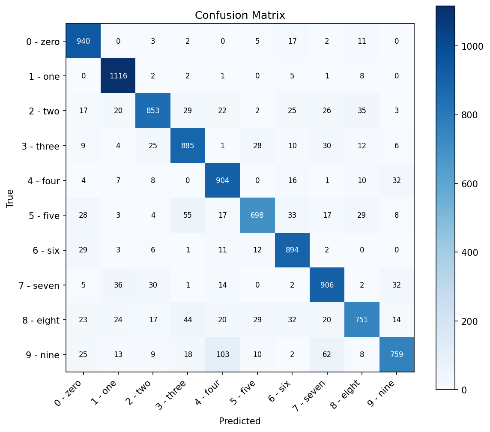
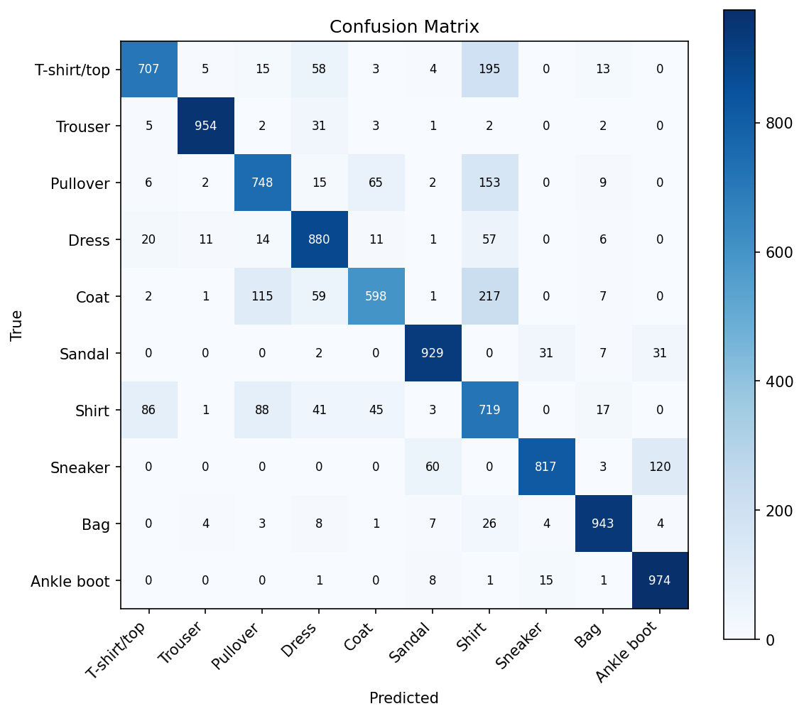

# Nonlinear-D2NN

A PyTorch-based reproduction and extension of the Diffractive Deep Neural Network (D2NN) introduced by [Lin et al., *Science* 2018](https://doi.org/10.1126/science.aat8084).

**What is D2NN?**  
A D2NN is an all-optical computing system where information is processed entirely through diffractive layers — each layer modulates the phase (and optionally the amplitude) of an incoming optical field, and free-space propagation between layers plays the role of a nonlinear mixing operation. Lin et al. demonstrated that such a system, trained end-to-end via back-propagation on a simulated wave-optics model, can classify handwritten digits and act as an imaging lens at terahertz frequencies.

**What this repository adds beyond the paper:**  
After reproducing the three main-text tasks (MNIST, Fashion-MNIST and the imaging lens), this repository systematically studies *intensity-dependent nonlinear field activations* inserted between diffractive layers — exploring three activation mechanisms (coherent amplitude gate, coherent phase shift, incoherent intensity detector) across four placement strategies (front, mid, back, all layers). The strongest configuration found so far (`incoherent_intensity + back`) is then evaluated on Fashion-MNIST, grayscale CIFAR-10 and RGB CIFAR-10 to assess cross-dataset transfer.

---

## Results

### Phase-Only Reproduction Baseline

| Task | Paper | This repo | Training |
|------|-------|---------|---------|
| MNIST classification | 97.61 % | **97.63 %** | 20 epochs, 5 layers, 200×200 px/layer |
| Fashion-MNIST classification | 81.13 % | **87.49 %** | 20 epochs, 5 layers, 200×200 px/layer |
| Imaging lens (D2NNImager) | qualitative | Test MSE = 0.0259 | 10 epochs on STL10, 5 layers |

> The imaging lens in this repo uses STL10 natural images rather than the paper's original terahertz beams; the propagation physics model is identical.

### Nonlinear Extension — Fashion-MNIST

Configuration: `incoherent_intensity` activation, `back` placement, 5-layer phase-only base, 20 epochs, seed 42.

| Configuration | Test Accuracy |
|---|---|
| Phase-only baseline | 87.49 % |
| + Nonlinear (back, 20 ep, seed 42) | **87.61 %** |
| + Nonlinear (back, 20 ep, seed 7) | 87.36 % |
| + Nonlinear (back, 20 ep, seed 123) | 87.28 % |

### Nonlinear Extension — Grayscale CIFAR-10

Configuration: same activation and placement, 10 epochs, two seeds.

| Configuration | seed=42 | seed=7 |
|---|---|---|
| Phase-only baseline | 35.09 % | 35.10 % |
| + Nonlinear (incoherent, back) | **39.48 %** (+4.4 pt) | **39.88 %** (+4.8 pt) |

### Nonlinear Extension — RGB CIFAR-10

Configuration: same activation and placement, 20 epochs, three seeds.

| Configuration | mean (3 seeds) | lift |
|---|---|---|
| Phase-only baseline | 45.27 % | — |
| + Nonlinear (incoherent, back) | **47.81 %** | **+2.54 pt** |

### Visualizations

| MNIST phase-only (20 ep) | Fashion-MNIST phase-only (20 ep) |
|:---:|:---:|
|  |  |

---

## Released Checkpoints

Trained weights and large experiment artifacts are distributed via [GitHub Releases](../../releases) rather than committed directly to the repository to keep clone size small.

| Release tag | Contents |
|---|---|
| `pre-nonlinear-phase-only-v1` | MNIST, Fashion-MNIST and STL10 imaging phase-only checkpoints; phase-plate exports |
| `nonlinear-incoherent-back-cifar10-rgb-v1` | RGB CIFAR-10 nonlinear vs. baseline checkpoint pairs (seed 42 / 7) |

---

## Installation

Requirements:
- Python 3.11+
- PyTorch 2.0+
- CUDA-capable GPU recommended (CPU works for unit tests)

Install [uv](https://docs.astral.sh/uv/getting-started/installation/) if you do not have it yet:

```bash
# Linux / macOS
curl -LsSf https://astral.sh/uv/install.sh | sh

# Windows (PowerShell)
powershell -ExecutionPolicy ByPass -c "irm https://astral.sh/uv/install.ps1 | iex"
```

Clone and install:

```bash
git clone https://github.com/yeungmkw/nonlinear-d2nn.git
cd nonlinear-d2nn

# Install runtime + dev dependencies (CPU-only PyTorch for testing)
uv sync --dev

# For GPU training, install the CUDA variant instead:
uv sync                  # uses pyproject.toml index pointing to cu126 wheels
```

> Some checkpoints and larger experiment artifacts are available from [GitHub Releases](../../releases) and are not included in the repository itself.

---

## Quick Start

### 1. Train a classification model

```bash
# MNIST — reproduces the paper's main result
uv run python train.py --task classification --dataset mnist --epochs 20 --size 200 --layers 5

# Fashion-MNIST
uv run python train.py --task classification --dataset fashion-mnist --epochs 20 --size 200 --layers 5

# RGB CIFAR-10 with nonlinear activation
uv run python train.py --task classification --dataset cifar10-rgb --epochs 20 \
    --size 200 --layers 5 \
    --activation-type incoherent_intensity --activation-placement back \
    --activation-preset balanced
```

### 2. Train an imaging lens

```bash
uv run python train.py --task imaging --dataset stl10 \
    --epochs 10 --size 200 --layers 5 --image-size 64 --batch-size 4
```

### 3. Evaluate and visualize

```bash
uv run python visualize.py --task classification --dataset fashion-mnist \
    --checkpoint checkpoints/best_fashion_mnist.pth
```

### 4. Export phase plates for fabrication

```bash
uv run python export_phase_plate.py --task classification \
    --checkpoint checkpoints/best_fashion_mnist.pth --export-stl
```

*Outputs are generated under `exports/<checkpoint_name>/`, including a Markdown report, `.npy` arrays, per-layer `.csv` data and optional `.stl` meshes.*

### 5. Print or run an ablation grid

```bash
# Preview commands for position ablation
uv run python train.py --print-experiment-grid coherent_amplitude_positions

# Run a mechanism ablation automatically (sequential)
uv run python train.py --run-experiment-grid activation_mechanisms \
    --task classification --dataset fashion-mnist --epochs 5
```

---

## Project Structure

```
nonlinear-d2nn/
├── d2nn.py               # Core: DiffractiveLayer, D2NNBase, D2NN, D2NNImager, nonlinear activations
├── tasks.py              # Dataset loaders, activation config, training / evaluation logic
├── artifacts.py          # Optics presets, checkpoint / manifest helpers, export utilities
├── train.py              # Unified training entrypoint (classification + imaging)
├── visualize.py          # Inference visualisation (detector output, confusion matrix, reconstructions)
├── export_phase_plate.py # Converts phase weights → height maps, CSV, STL
├── tests/                # Unit tests (77 tests covering optics, activations, CLI, numerics)
├── docs/baselines/       # Frozen baseline records used as control groups for ablations
├── figures/              # Representative result figures committed to the repository
└── pyproject.toml        # Dependencies managed with uv
```

---

## Known Limitations & Scope

- **Numerical simulation only**: This repository is a wave-optics simulation framework. It does not integrate physical optical tabletop experiments.
- **Paraxial approximation**: Propagation uses the Angular Spectrum Method (ASM) under paraxial assumptions; highly oblique diffraction setups may require more rigorous routines.
- **Imaging dataset**: The current imaging examples use STL10 rather than ImageNet-style natural images as in the paper's supplementary material.
- **Fabrication-aware training**: Physical constraints (material relief limits, quantization) can be exported after training but are not yet part of the optimization loop.

---

## References

- **Core paper**: Lin, X., Rivenson, Y., Yardimci, N. T., Veli, M., Luo, Y., Jarrahi, M., & Ozcan, A. (2018). All-optical machine learning using diffractive deep neural networks. *Science*, 361(6406), 1004–1008. [doi:10.1126/science.aat8084](https://doi.org/10.1126/science.aat8084)
- Yan, T., Yang, J., Zheng, Z., et al. Multilayer nonlinear diffraction neural networks with programmable and fast ReLU activation function. *Nature Communications* (2025). [Article](https://www.nature.com/articles/s41467-025-65275-0)
- Wang, R., et al. A surface-normal photodetector as nonlinear activation function in diffractive optical neural networks (2023). [arXiv:2305.03627](https://arxiv.org/abs/2305.03627)
- Wetzstein, G., et al. Reprogrammable Electro-Optic Nonlinear Activation Functions for Optical Neural Networks (2019). [arXiv:1903.04579](https://arxiv.org/abs/1903.04579)
