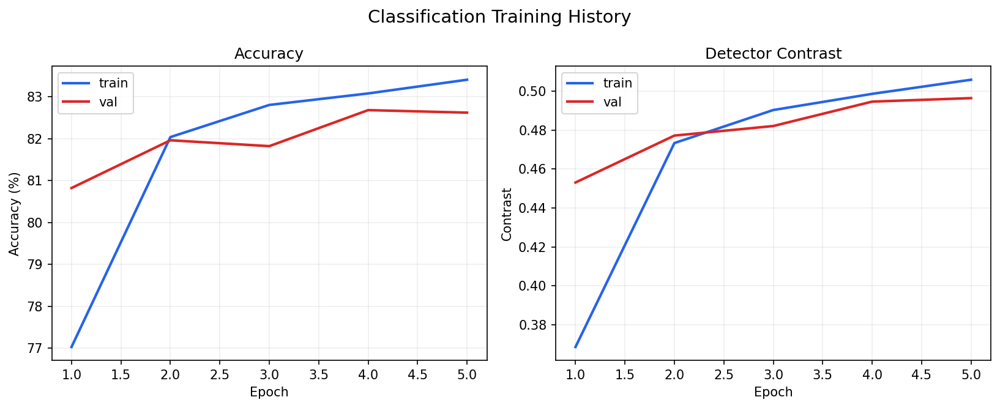
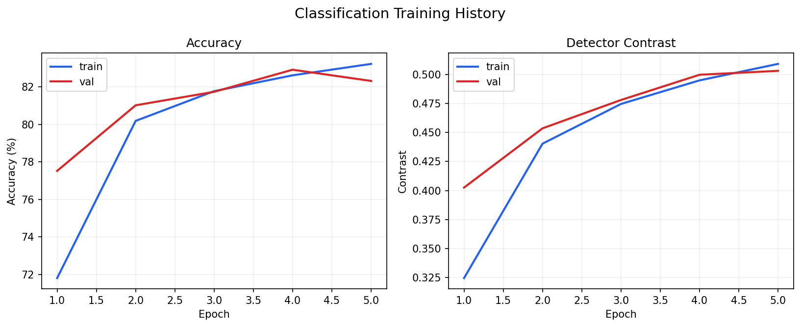
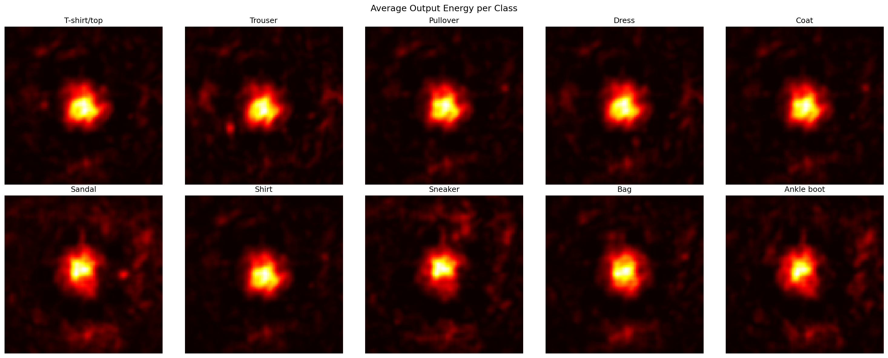
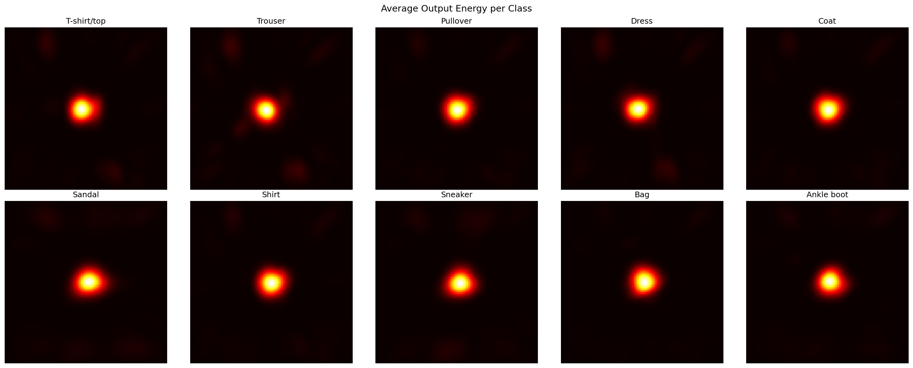

# Nonlinear-D2NN

A PyTorch reproduction and extension of the Diffractive Deep Neural Network (D2NN) from [Lin et al., Science 2018](https://doi.org/10.1126/science.aat8084).

## Overview

This repository contains:

- a classification and imaging D2NN simulation pipeline
- nonlinear activation experiments inserted between diffractive layers
- fabrication-oriented phase export tooling

The active code path now uses Rayleigh-Sommerfeld propagation (`rs_v1`), composite classification loss, and contrast-aware checkpoint selection.

If you only need the active training path, start with [train.py](train.py) and the "Current Training Snapshot" section below.

## Status

- Current `main` should be understood through the `rs_v1` implementation, not through older ASM-era experiment numbers.
- Detailed statistics do not live in this README. They are kept in report files and experiment artifacts.
- Archived pre-RS outputs were removed from the working tree to avoid contaminating new runs.

Current detail entrypoints:

- [reports/post_rs_compressed/2026-04-10/summary.md](reports/post_rs_compressed/2026-04-10/summary.md)
- [checkpoints_proxy/best_fashion_mnist.fashion_mnist_phase_only_5ep_size100_seed42_post_rs_fft_proxy.json](checkpoints_proxy/best_fashion_mnist.fashion_mnist_phase_only_5ep_size100_seed42_post_rs_fft_proxy.json)
- [checkpoints_proxy/best_fashion_mnist.fashion_mnist_incoherent_back_5ep_size100_seed42_post_rs_fft_proxy.json](checkpoints_proxy/best_fashion_mnist.fashion_mnist_incoherent_back_5ep_size100_seed42_post_rs_fft_proxy.json)

Archive root for removed pre-RS artifacts:

- `～\d2nn_artifact_archive\2026-04-09-pre-rs`

## Current Training Snapshot

[train.py](train.py) is the main training entrypoint for the active RS training path. The current proxy validation is the shortest complete proof that `train.py -> checkpoint -> manifest -> contrast -> visualize.py` works under `rs_v1`.

The main quantitative fields to read from each classification manifest are:

- `best_val_accuracy`
- `best_val_contrast`
- `best_epoch`
- `test_accuracy`
- `test_contrast`
- `history`

Proxy configuration:

- `Fashion-MNIST`
- `size=100`
- `layers=5`
- `epochs=5`
- `seed=42`
- `rs-backend=fft`

| Variant | Activation | Test acc | Test contrast | Best val acc | Best val contrast |
| --- | --- | ---: | ---: | ---: | ---: |
| `phase-only` | `none` | 82.08 | 0.4925 | 82.68 | 0.4946 |
| `incoherent_back` | `incoherent_intensity@back` | 82.22 | 0.4964 | 82.92 | 0.4997 |

- `incoherent_back - phase-only`: `+0.14 pt` accuracy, `+0.0039` contrast.
- Both runs exceeded the paper target accuracy `81.13%` under the proxy configuration.
- Full details: [reports/post_rs_compressed/2026-04-10/summary.md](reports/post_rs_compressed/2026-04-10/summary.md)

Key figures:

Training history

| Phase-only | Incoherent-back |
| --- | --- |
|  |  |

Output energy

| Phase-only | Incoherent-back |
| --- | --- |
|  |  |

## Installation

Requirements:

- Python 3.11+
- PyTorch 2.0+
- CUDA-capable GPU recommended

Install [uv](https://docs.astral.sh/uv/getting-started/installation/) first if needed:

```bash
# Linux / macOS
curl -LsSf https://astral.sh/uv/install.sh | sh

# Windows PowerShell
powershell -ExecutionPolicy ByPass -c "irm https://astral.sh/uv/install.ps1 | iex"
```

Clone and install:

```bash
git clone https://github.com/yeungmkw/nonlinear-d2nn.git
cd nonlinear-d2nn
uv sync
uv sync --dev
```

## Quick Start

### Training Entry Point

`train.py` is the main entrypoint for both classification and imaging experiments. `visualize.py` consumes the resulting checkpoints and manifests to generate the figures above.

Current proxy validation runs:

```bash
uv run python train.py --task classification --dataset fashion-mnist --epochs 5 \
    --size 100 --layers 5 --seed 42 --rs-backend fft

uv run python train.py --task classification --dataset fashion-mnist --epochs 5 \
    --size 100 --layers 5 --seed 42 \
    --activation-type incoherent_intensity --activation-placement back \
    --activation-preset balanced --rs-backend fft
```

Representative full-budget classification commands:

```bash
uv run python train.py --task classification --dataset mnist --epochs 20 --size 200 --layers 5

uv run python train.py --task classification --dataset fashion-mnist --epochs 20 --size 200 --layers 5

uv run python train.py --task classification --dataset cifar10-rgb --epochs 20 \
    --size 200 --layers 5 \
    --activation-type incoherent_intensity --activation-placement back \
    --activation-preset balanced
```

Train imaging:

```bash
uv run python train.py --task imaging --dataset stl10 \
    --epochs 10 --size 200 --layers 5 --image-size 64 --batch-size 4
```

Visualize:

```bash
uv run python visualize.py --task classification --dataset fashion-mnist \
    --checkpoint checkpoints/best_fashion_mnist.pth
```

Export phase plates:

```bash
uv run python export_phase_plate.py --task classification \
    --checkpoint checkpoints/best_fashion_mnist.pth --export-stl
```

Single-layer lab path (`852 nm`, `1 um`, measured input/output distances):

```bash
uv run python train.py --task classification --dataset fashion-mnist \
    --epochs 1 --size 200 --layers 1 --seed 42 \
    --optics-preset lab852_f10 --experiment-stage lab_single_layer

uv run python visualize.py --task classification --dataset fashion-mnist \
    --checkpoint checkpoints/<single-layer-run>.pth --no-show

uv run python export_phase_plate.py --task classification \
    --checkpoint checkpoints/<single-layer-run>.pth --export-bmp
```

- Global measured defaults now use `wavelength = 852 nm`, `pixel_size = 1 um`, `input_distance = 491.302 mm`, and `output_distance = 575.304 mm`.
- `lab852_f10` and `lab852_f5` currently only differ in their provisional inter-layer `layer_distance` values (`~1.17 mm` and `~2.35 mm`).
- The current handoff path is still restricted to classification `--layers 1` runs for the non-paper presets and should not be combined with manual optics overrides.
- Inter-layer spacing has not been re-measured yet, so multi-layer defaults still preserve their previous `layer_distance` until that value is confirmed.
- Keep the checkpoint `.json` manifest next to the `.pth` when visualizing/exporting lab runs; that manifest carries the optical config needed to avoid falling back to paper optics.

Run the frozen fabrication export wrapper:

```bash
copy fabrication/fmnist5-phaseonly-aligned.lab.template.json fabrication/fmnist5-phaseonly-aligned.lab.json
uv run python export_fmnist5_phaseonly_aligned_final.py --lab-config fabrication/fmnist5-phaseonly-aligned.lab.json
```

Preview or run ablation grids:

```bash
uv run python train.py --print-experiment-grid coherent_amplitude_positions

uv run python train.py --run-experiment-grid activation_mechanisms \
    --task classification --dataset fashion-mnist --epochs 5
```

## Where To Look

If you need the current fabrication-target line first:

- [docs/INDEX.md](docs/INDEX.md)
- [docs/official-artifacts/fmnist5-phaseonly-aligned/](docs/official-artifacts/fmnist5-phaseonly-aligned/)
- [docs/fabrication/fashion-mnist-phase-only-lightpath-protocol.md](docs/fabrication/fashion-mnist-phase-only-lightpath-protocol.md)
- [docs/fabrication/fashion-mnist-phase-only-lab-handoff.md](docs/fabrication/fashion-mnist-phase-only-lab-handoff.md)
- [docs/fabrication/lab-single-layer-workflow.md](docs/fabrication/lab-single-layer-workflow.md)

If you need detailed experiment numbers:

- use `reports/`
- use `checkpoints_proxy/*.json` or `checkpoints/*.json`
- use [docs/Reproduction/](docs/Reproduction/)
- do not mine the README for statistics

## Project Layout

```text
nonlinear-d2nn/
|- d2nn.py
|- tasks.py
|- artifacts.py
|- train.py
|- visualize.py
|- export_phase_plate.py
|- tests/
|- docs/
|- reports/
|- figures/
`- pyproject.toml
```

## Limitations

- Numerical simulation only; no physical tabletop integration.
- The active RS direct-space training path is materially slower than the earlier ASM/FFT trunk.
- Repo-visible post-RS numbers currently include reevaluation reports and compressed proxy validation; they are not yet a full same-budget retrain replacement.
- Imaging examples currently use STL10 rather than the paper's original imaging setup.
- Fabrication constraints are exported after training, not optimized in-loop.

## References

- Lin, X., Rivenson, Y., Yardimci, N. T., Veli, M., Luo, Y., Jarrahi, M., and Ozcan, A. (2018). All-optical machine learning using diffractive deep neural networks. Science, 361(6406), 1004-1008. [doi:10.1126/science.aat8084](https://doi.org/10.1126/science.aat8084)
- Yan, T., Yang, J., Zheng, Z., et al. Multilayer nonlinear diffraction neural networks with programmable and fast ReLU activation function. Nature Communications (2025). [Article](https://www.nature.com/articles/s41467-025-65275-0)
- Wang, R., et al. A surface-normal photodetector as nonlinear activation function in diffractive optical neural networks (2023). [arXiv:2305.03627](https://arxiv.org/abs/2305.03627)
- Wetzstein, G., et al. Reprogrammable Electro-Optic Nonlinear Activation Functions for Optical Neural Networks (2019). [arXiv:1903.04579](https://arxiv.org/abs/1903.04579)
